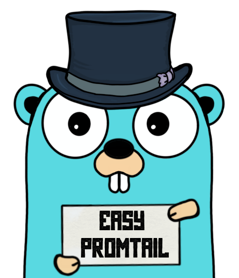

# Promtail Client

A native Golang client for [Grafana's Loki logging server](https://grafana.com/oss/loki/) (written with love and tests).

## Description

It's a lightweight client for pushing logs with Loki server written in pure Go 
with zero external dependencies.

#### Current implementation contains:

 - [X] REST client with batching that supports 6 levels of logs: **Debug, Info, Warning, Error, Fatal, Panic**
 - [X] Pluggable logs exchange mechanism (see `StreamExchanger` interface) and it's
  Loki JSON v1 API implementation
 - [X] Embedded label `logLevel` for easier log grepping
 - [ ] TODO: add `proto` logs format for Loki API
 
 ## How to use
 
The easiest way is to initialize a predefined JSON v1 API client via:
~~~go
package mypackage

import "github.com/ic2hrmk/promtail"

func foo() error {
    // List of default labels which would be attached to every log message
    identifiers := map[string]string {
        "instanceId": "myAwesomeApp-1",
    }

    promtailClient, err := promtail.NewJSONv1Client("loki:3100", identifiers)
    if err != nil {
       return err
    }
    defer promtailClient.Close()

    promtailClient.Infof("I am here for ya %s", "buddy")

    // Some staff...

    promtailClient.Logf(promtail.Info, "Still here")

    promtailClient.Debugf("I am here for ya %s", "buddy")    
    promtailClient.Infof("I am here for ya %s", "buddy")    
    promtailClient.Warnf("I am here for ya %s", "buddy")    
    promtailClient.Errorf("I am here for ya %s", "buddy")    
    promtailClient.Fatalf("I am here for ya %s", "buddy")    
    promtailClient.Panicf("I am here for ya %s", "buddy")    
    
    customLabels := map[string]string {
        "somethingSpecial": "right-here",
    }
    promtailClient.LogfWithLabels(promtail.Info, customLabels, "Still here")

    return nil
}
~~~
 
## How to tune

[Q]: How can I use another version/protocol of Loki API's implementation?
[A]: You can implement `StreamExchanger` and pass it to constructor `NewClient()` or make an issue :)

[Q]: How can I get errors from exchanging process instead reading logs?
[A]: Initialize a client with option `WithErrorCallback(errorHandler func(err error))`:
~~~go
allertHandler := func(err error) {
   slack.NotifyError("loki logging is unavailable due to: %s", err)
}

promtailClient, err := NewJSONv1Client("loki:3100",  nil, 
    WithErrorCallback(allertHandler)
)
~~~
Also, take a look at `WithSendBatchSize()` (max messages number to send at one 
time) and `WithSendBatchTimeout()` (max timeout of messages if not messages number 
isn't reaching send batch size).

### Issues / Contributing
Feel free to post a Github Issue, I will respond ASAP
 
